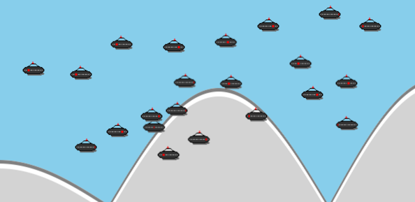

# ufo


Animating UFOs with VanillaJS.

- HTML canvas
- spritesheet-based animation
- simple game loop with update() and draw() functions
- uses Parcel bunder to run locally (with watch) or create a distribution
- optionally build as a library to include JS on any website (uses `esbuild`)



## Run Local Dev Server

    npm install  # install dependencies

    npm start
    # visit http://localhost:1234

## Run Tests

    npm test

## Package project up in dist folder for release to server

    npm run build

## Run lint

    npm run lint

## Build as a library to use on another site

    # create `dist/ufo-widget.js`
    npm run build-library

Example usage:

```html
<canvas id="my-canvas" width="600" height="300"></canvas>
<script src="./ufo-widget.js"></script>
<script>
  const canvas = document.getElementById('my-canvas');
  ufoWidget.default({
    canvas,
    scale: 1,
    entityCount: 22
  });
</script>
```
